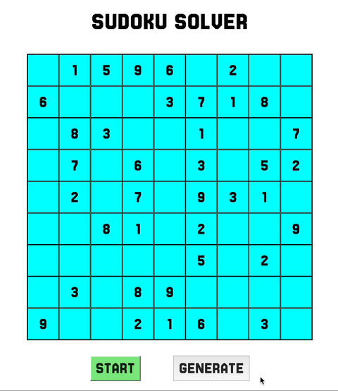

# Sudoku Solver

## Introduction
This is a visualisation of backtracking algorithm used to solve sudoku puzzles.
Random puzzles are fetched from [here](https://github.com/grantm/sudoku-exchange-puzzle-bank)

## Demo

